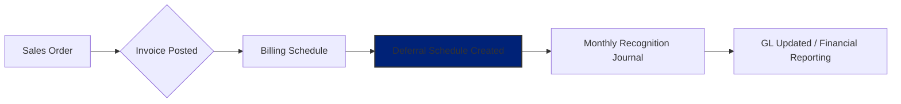

# Neil Echiverri | Dynamics 365 FinOps Functional Consultant
**Specialization:** Financial Automation | Global Microsoft Dynamics 365 F&O Rollouts

<table>
    <tr>
        <th>
            
        </th>
    </tr>
</table>

> **"Bridging the gap between complex accounting standards and D365FO technical configuration to drive business transformation."**

---

## 🚀 Featured Project: Global Subscription Revenue Transformation

**Client Archetype:** APAC-based Technology & Managed Services Provider  
**Core Modules:** Subscription Billing (Revenue & Expense Deferrals), Sales & Marketing, General Ledger  
**Compliance Standards:** ASC 606 / IFRS 15

### 🎯 The Challenge
The client relied on a manual, Excel-based revenue recognition process for over 500+ monthly service contracts, leading to high audit risks and reconciliation delays.
* **Pain Points:** Human error in monthly journals, lack of traceability for mid-term contract changes, and a 3-day month-end closing cycle for revenue recognition.

### 🛠️ The Solution
* I led the end-to-end implementation of the **D365FO Subscription Billing** module to automate the deferral lifecycle.

**Functional Highlights:**
* **Automated Deferral Logic:** Designed templates triggered by Sales Order invoicing to generate real-time deferral schedules.
* **Dynamic Adjustments:** Configured the system to handle mid-term **Credit Notes**. By linking credits to original Sales Orders, the system automatically adjusts the deferral schedule, preventing revenue leakage or "double-booking."
* **Multi-Currency Orchestration:** Automated exchange rate revaluation for regional entities (SGD, AUD, USD), ensuring consolidated financial accuracy.

### 📊 Logic Flow

### 📈 The Business Impact
* **Efficiency:** Reduced the monthly revenue recognition cycle from **3 days to 4 hours**.
* **Audit Readiness:** Achieved 100% drill-down traceability from GL entries back to the original source contract.
* **Accuracy:** Eliminated "double-booking" risks by synchronizing credit notes with active deferral schedules.

### 💡 Expert Note: Cutover Strategy
* I managed the transition from legacy systems by finalizing ending main account balances and re-configuring deferral schedules only for the **remaining duration** of active contracts. This ensured a "Clean Slate" go-live without duplicating previously recognized revenue.

### 🛠️ Technical Expertise & Methodology
* **Implementation:** End-to-End (FDD creation, Configuration, UAT, Go-Live Support).
* **Data Management:** Proficient in **DIXF (Data Management Framework)** for complex data migrations.
* **Process Mapping:** Proficient in visualizing business logic via **Mermaid.js** and **MS Visio**.
* **Ecosystem:** Proficient in **LCS**, **Azure DevOps** for ALM, and **Power Platform** integrations.

---

### 📫 Connect With Me
* **LinkedIn:** https://www.linkedin.com/in/nrechiverri
* **Email:** nrechiverri@outlook.com
* **Location:** Based in Manila, PH
